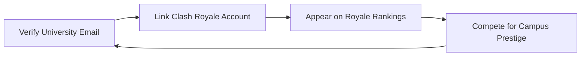

# ClashCampus

> **Where Clash Becomes Culture**

ClashCampus turns Clash Royale performance into **social identity on campus**. Players **link and verify** their Clash Royale account, get matched to a **verified university identity**, and appear on public leaderboards called **Royale Rankings**.

## Core Product Loop



## Key Invariants

- **Verified university email**: users must prove they belong to a specific university
- **Verified Clash Royale account**: users must prove they control the in-game account they claim
- **Public campus leaderboard**: university-vs-university rankings are viewable publicly
- **Protected player data**: individual player rankings visible only to verified students at the same university

## Tech Stack

- **Framework**: [Next.js 16](https://nextjs.org/) (App Router)
- **Database + Auth**: [Supabase](https://supabase.com/) (PostgreSQL + Auth + RLS)
- **Styling**: [Tailwind CSS 4](https://tailwindcss.com/)
- **Language**: TypeScript 5

## Getting Started

### Prerequisites

- Node.js 20+
- npm or pnpm
- Supabase CLI (for local development)

### Environment Variables

Create a `.env.local` file with:

```bash
# Supabase
NEXT_PUBLIC_SUPABASE_URL=your_supabase_project_url
NEXT_PUBLIC_SUPABASE_PUBLISHABLE_KEY=your_supabase_anon_key

# Site URL (used for auth redirects)
NEXT_PUBLIC_SITE_URL=http://localhost:3000

# Optional: Log level for development
LOG_LEVEL=debug
```

### Supabase Email Template Setup

For server-side auth to work correctly, update your Supabase email templates:

1. Go to **Supabase Dashboard > Authentication > Email Templates**
2. In the **"Confirm signup"** template, replace:
   ```
   {{ .ConfirmationURL }}
   ```
   with:
   ```
   {{ .SiteURL }}/auth/confirm?token_hash={{ .TokenHash }}&type=email
   ```

This routes email confirmations through the Next.js server-side handler.

### Development

```bash
# Install dependencies
npm install

# Start Supabase locally (optional)
supabase start

# Run the development server
npm run dev
```

Open [http://localhost:3000](http://localhost:3000) to see the app.

### Database Migrations

Migrations are in `supabase/migrations/`. To apply them locally:

```bash
supabase db reset
```

To generate TypeScript types from your schema:

```bash
supabase gen types typescript --local > lib/supabase/types.ts
```

## Project Structure

```
app/                    # Next.js App Router pages
├── (auth)/             # Auth route group (login, signup)
├── auth/               # Auth callbacks (confirm, error)
├── rankings/           # Public rankings page
└── layout.tsx          # Root layout

components/
├── auth/               # Auth-related components
├── landing/            # Landing page sections
├── rankings/           # Rankings page components
└── ui/                 # Shared UI components

lib/
├── auth/               # Auth utilities (validation)
├── data/               # Data fetching (mock data for now)
├── logger.ts           # Pino-based structured logging
└── supabase/           # Supabase clients (client, server, proxy)

supabase/
└── migrations/         # Database schema + RLS policies

types/                  # Shared TypeScript types
```

## Auth Flow

1. **Signup**: User enters university email + password
2. **Email sent**: Supabase sends confirmation email
3. **Confirmation**: User clicks link → `/auth/confirm` verifies token
4. **Session**: User is redirected to `/rankings` with active session

## Proxy (Route Protection)

Next.js 16 uses `proxy.ts` (renamed from middleware) for request interception:

- Refreshes Supabase auth tokens on every page load
- Redirects unauthenticated users away from protected routes
- `/rankings` is public (campus leaderboard); player data is protected by RLS

## Scripts

```bash
npm run dev      # Start development server
npm run build    # Build for production
npm run start    # Start production server
npm run lint     # Run ESLint
```

## Learn More

- [Next.js Documentation](https://nextjs.org/docs)
- [Supabase Documentation](https://supabase.com/docs)
- [Tailwind CSS Documentation](https://tailwindcss.com/docs)
